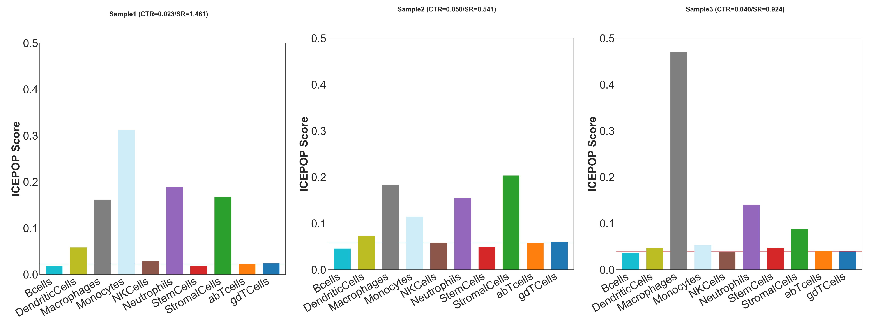

ICEPOP 
=============================================================================
Immune CEll POPulation


Overview
--------
A method for estimating immune cell
population in the expressed genes. It enable analysis of differentially
expressed genes (DEGs) or raw expression data. These APIs and scripts will let
you have a fine grained control on the data analysis lacking in the web
version. On top of the core immune cell population deconvolution, it allows
you to download the raw data from NCBI GEO gene expression database,
normalize, and plot the data using command line interface.


Installation
------------
ICEPOP is best installed via [pip](https://pip.pypa.io/en/stable/) through
one of the following commands::

    $ pip install git+https://github.com/ewijaya/icepop.git 
    $ pip install git+https://github.com/ewijaya/icepop.git --upgrade
    $ pip install git+git://github.com/ewijaya/icepop.git
    $ pip install git+git://github.com/ewijaya/icepop.git --upgrade


Alternative access 
------------------
* Web application [[main](https://vdynamics.shinyapps.io/icepop/)][[mirror](https://ewijaya.shinyapps.io/icepop/)]
* [API documentation](http://ewijaya.github.io/icepop/html/index.html) 

Calculating immune response score from DEGs
-------------------------------------------
The input should be either in form of CSV or TSV files.
The results can be in the form of table or plot. They are determined by the
suffix of the output file.

To create bar plot use this command:

    $ icepop_degs input_type1_degs.tsv -fclim 2 -s mouse -o output_file.jpg

The command will produce individual plots depending on the number of samples.




To create table:

```
$ icepop_degs input_type1_degs.tsv -fclim 2 -s mouse -o output_file.tsv
$ icepop_degs input_type1_degs.tsv -fclim 2 -s mouse -o output_file.xlsx
```

Suffixes of the output should either one of these: 'svg', 'jpg', 'png', 'tsv', 'xlsx', 'xls'.


Circos plot for unearthing the gene features in immune cells
------------------------------------------------------------
It assumes that [Circos](http://www.circos.ca/)  is already installed
in your main path. Typical use looks like this in Bash script:


``` bash
INFILE=input_type1_degs.tsv
CIRCOS_DIR=your_circos_dir
CIRCOS_CONF=//anaconda/lib/python2.7/site-packages/icepop/circos_conf/

icepop_degs_circos_uniform $INFILE \ 
    --go \
    -fclim 2 \
    -circos_dir $CIRCOS_DIR

cd $CIRCOS_DIR
cp -r $CIRCOS_CONF .
circos -param random_string='image' -conf ./etc/circos-medium.conf
```

This script produces the circular plot that links feature genes among the samples.


